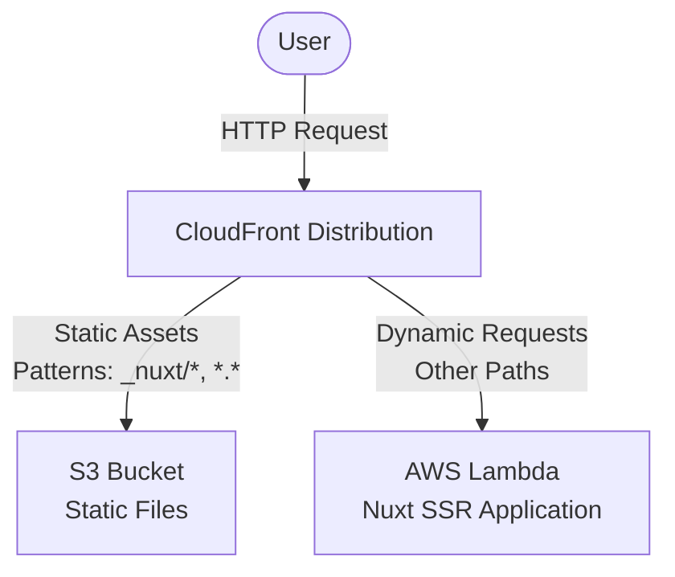

# Nuxt 3 on AWS Lambda Demo Project

This repository serves as a technical demo for deploying **Nuxt 3 applications** to AWS Lambda, delivering content through CloudFront and S3. It showcases how to run a Nuxt application with Server-Side Rendering (SSR) in a serverless architecture.

## Technology Stack

- **Frontend**
  - Nuxt 3
  - Vue 3
  - TypeScript
- **Infrastructure**
  - AWS Lambda
  - AWS CloudFront
  - AWS S3
  - AWS CloudFormation

## AWS Architecture

This project employs the following architecture to deliver Nuxt 3 applications:



## Deployment Instructions

### Prerequisites

- AWS CLI installed and configured
- Node.js 20+ installed
- npm installed

### Deployment Steps

#### 1. Clone the Repository

```bash
git clone https://github.com/nakat-t/nuxt3-on-aws-lambda-demo.git
cd nuxt3-on-aws-lambda-demo
```

#### 2. Install Dependencies

```bash
npm install
```

#### 3. Prepare S3 Bucket

Create an S3 bucket to store deployment packages:

```bash
REGION=YOUR_REGION ./setup-s3.sh
```

In `REGION`, specify the region where you want to create the S3 bucket. This will create an S3 bucket named `nuxt-demo-s3-bucket`. This will be used by the **aws cloudformation package** command used to upload the Lambda binary.

#### 4. Build and Package the Application

```bash
./build.sh
```

This script will:
- Build the Nuxt application
- Create a deployment package (ZIP) for AWS Lambda

#### 5. Deploy to AWS

Deploy AWS resources using CloudFormation:

```bash
./deploy.sh
```

You can customize with the following environment variables:
- `STACK_NAME`: CloudFormation stack name (default: nuxt-demo-test-stack)

Upon successful deployment, the CloudFront distribution URL will be displayed in the console.

> [!NOTE]  
> The script for cleaning up AWS resources is not included. To delete the deployment, please delete the CloudFormation stack and the S3 bucket created with ./setup-s3.sh manually. This will completely clear the environment.

## Project Structure

```
nuxt3-on-aws-lambda-demo/
├── app.vue                  # Main Vue application component
├── nuxt.config.ts           # Nuxt configuration file (with AWS Lambda settings)
├── server/
│   └── api/
│       └── greet.ts         # Server-side API endpoint
├── cfn.yaml                 # CloudFormation template
├── build.sh                 # Build script
├── setup-s3.sh              # S3 bucket preparation script
└── deploy.sh                # Deployment script
```

## Acknowledgements

This project was inspired by the article [Deploy Nuxt 3 on AWS Lambda](https://medium.com/@michaelbouvy/deploy-nuxt-3-on-aws-lambda-a53991f0ad7e).

This demo adds the following elements to the above article.

1. CloudFront + Lambda integration
2. Change nuxt.config.ts to `serveStatic: false`. Static file delivery using S3
3. Complete CloudFormation template

## License

This project is released under the MIT License. See the [LICENSE](LICENSE) file for details.
